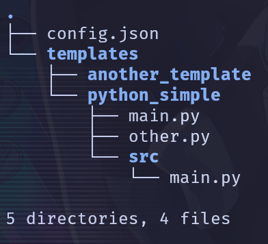

# Buddy

> :warning: **This project is still in development and is not ready for use.**<br>
> :warning: **And will be subject to breaking changes often.**

A CLI to help automate your development workflow.

## Requirements

- Go (>= 1.21)

## Installation

```bash
go install github.com/dreadster3/buddy@latest
```

## Usage

### Initialization

Initialize a new project with buddy.

```bash
buddy init <project-name>
```

Or initialize an already existing project, which defaults the project name to the current directory name.

```bash
buddy init
```

This will generate an empty `buddy.json` file in the root of your project.
Here is an example.

```json
{
  "name": "<project-name>",
  "version": "0.0.1",
  "description": "A new buddy project",
  "author": "Anonymous",
  "scripts": {}
}
```

You can add scripts to the `scripts` object in the `buddy.json` file.

```json
{
  "name": "<project-name>",
  "version": "0.0.1",
  "description": "A new buddy project",
  "author": "Anonymous",
  "scripts": {
    "start": "go run main.go",
    "build": "go build -o dist/main main.go",
    "test": "go test"
  }
}
```

### Running scripts

You can run these scripts using the `buddy run` command.

```bash
buddy run <script-name> <args>

buddy <script-name> # Shorthand notation (cannot be used if it overlaps with existing `buddy` commands)
```

Use the `buddy run --list` command to list all the scripts in the `buddy.json` file.

```bash
buddy run --list
```

### Get attribute from `buddy.json`

You can get the value of an attribute from the `buddy.json` file using the `buddy get` command.

```bash
buddy get <attribute-name>
```

## Personal Project Templates

You can create your own project templates to initialize a new project with buddy.
This can be achieved by creating a new folder under the `$HOME/.config/buddy/templates`(default path) directory.
The name of the directory will represent the name of the template.



You can use project templates to initialize a new project with buddy.

```bash
buddy init --template <template-name> <project-name>
```
